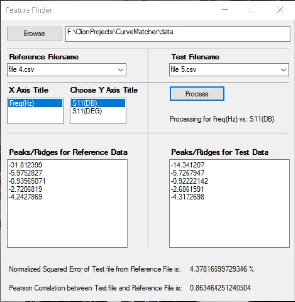

## CurveMatcher

**Problem Statement:** How can I find peaks and troughs of a graph? How to find relative error and correlation between two graphs?

**Languages:** C++

**Build Tool:** CMake 3.5

**Additional Libraries:** Boost 1.61.0

**Source**: [https://github.com/apanimesh061/CurveMatcher](https://github.com/apanimesh061/CurveMatcher)

**Github Page**: [https://apanimesh061.github.io/projects/curvematcher#part-ii](https://apanimesh061.github.io/projects/curvematcher#part-ii)

I will be discussing about the algorithms and techniques that I used to solve the above mentioned problem. I also made a console based application which accepts input from command line and processes them. The full console based project is [here](https://github.com/apanimesh061/CurveMatcher).

- - -

I tried to make a version of [CurveMatcher](https://github.com/apanimesh061/CurveMatcher) that runs on Visual Studio 2015 and a GUI interface using Windows Forms. The application has been named **FeatureFinder**.

**Languages:** Visual C++

**Framework:** .Net with Windows Forms

**Source**: [https://github.com/apanimesh061/FeatureFinder](https://github.com/apanimesh061/FeatureFinder)

#### Snapshots

This is how the actual GUI looks like:

##### Glossary

| Parts               | Description                                 |
| ------------------- | ------------------------------------------- |
| Browse              | Helps in choosing the folder                |
| Reference Filename  | Choose the reference CSV file from dropdown |
| Test Filename       | Choose the test CSV file from dropdown      |
| X Axis Title        | Title of the X-Axis of the graph            |
| Choose Y Axis Title | Title of the Y-Axis of the graph            |
| Process             | Performs the computation                    |

After you choose a folder that has CSV files:

After you click `Process`:

#### Demo

